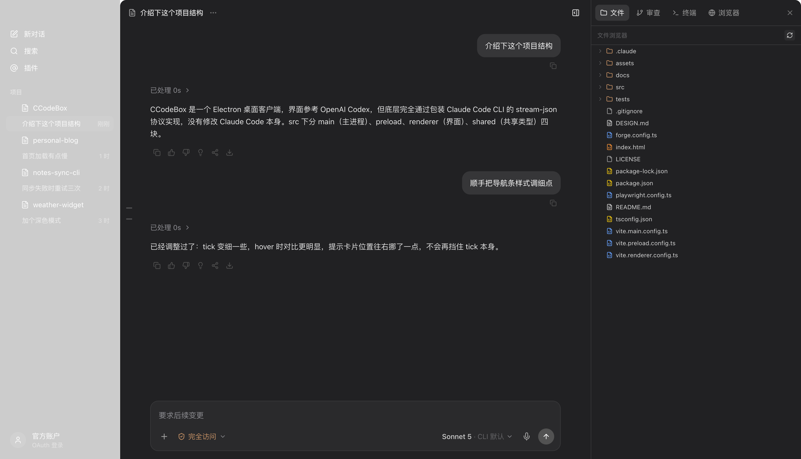

<div align="center">

# CCodeBox

**给 Claude Code 的一层精致外壳。**

界面仿 Codex 桌面端,后台完全由 `claude` CLI 驱动 —— 不调私有 API、不改 CLI 本身,只把它已有的能力(stream-json 协议、`--resume`、hooks、`.mcp.json`……)包装成更好的图形界面。

<a href="https://github.com/anthropics/claude-code">Claude Code</a> · <a href="./DESIGN.md">设计文档</a>

[](https://github.com/Xiamu-ssr/ClaudeX)
[](https://www.electronjs.org/)
[](https://react.dev/)
[](https://www.typescriptlang.org/)
[](./LICENSE)
[](https://github.com/Xiamu-ssr/ClaudeX/pulls)
[](https://github.com/Xiamu-ssr/ClaudeX)




</div>

---

## ✨ 亮点

- 🖥️ **真实多轮对话** — 长驻子进程 + stream-json 双向通信;工具调用、thinking 旁白、错误态实时展示为可展开步骤
- 🧭 **对话导航条** — 对话区侧边细导航条,悬浮预览每一轮内容,一键跳转到长对话中的任意历史轮次
- 📜 **真实历史会话** — 直接读取 `~/.claude/projects` 下的 `.jsonl`,无需额外索引
- 🗂️ **项目 / 会话管理** — 置顶、重命名、折叠、归档、移除、Finder 定位、创建 git 工作树;软状态存独立 sidecar,绝不改动 Claude Code 的真实数据
- 🌿 **会话分叉** — 从任意历史会话的最新一轮分叉出新会话
- 🔌 **模型 / 供应商** — 内置 Anthropic + 自定义供应商(自定义 base URL / token),支持对话中途切模型、设 `--effort` 推理强度
- 🛠️ **右侧工作面板** — 文件树(语法高亮预览)· Git diff · 真实终端(node-pty + xterm.js)· 内嵌浏览器,四 tab 全是真实数据,无占位;面板宽度可拖拽调整并记忆
- 🧩 **插件 / MCP** — 读取 `claude plugin list` 与 `~/.claude.json`,按官方技能 / connector / 个人技能 / 第三方插件 / 自定义 MCP 服务器分类展示
- ⚙️ **设置页** — 钩子 / 权限 / 环境变量(脱敏)/ Git 状态 / 用量统计 / 强调色主题,全部来自本机真实文件

> 每个设计决策背后的取舍(为什么包装 CLI 而非 Agent SDK、stream-json→UI 映射规则、node-pty 打包三个坑的根因……)见 [DESIGN.md](./DESIGN.md)。

## 🚀 快速开始

```bash
nvm use 22.17.1   # 需 Node 22 LTS(Node 24 下 electron-forge 会静默卡住)
npm install
npm run dev        # electron-forge start,带热重载
```

**前置**:已安装并登录的 [Claude Code CLI](https://github.com/anthropics/claude-code)(`claude auth status` 应为已登录)。目前仅验证 macOS。

## 📦 构建打包

```bash
nvm use 22.17.1
export HTTP_PROXY=http://127.0.0.1:7890 HTTPS_PROXY=http://127.0.0.1:7890   # 原生模块 rebuild 需连 GitHub
npm run build      # 产出 DMG
```

只打包不生成安装包:`npm run package`(产物在 `out/`,已 gitignore)。

## 🧪 测试

```bash
npx playwright test
```

E2E 用 Playwright 的 `_electron` API 经 CDP 直接驱动真实窗口,不占屏、不需辅助权限;涉及发消息的用例会注入一个假 `claude` 二进制保证确定性,不消耗真实 API 额度。

## 🏗 架构

```
Renderer (React + Zustand)
   │   window.electronAPI.claude.*   (contextBridge)
 Preload
   │   ipcMain.handle / webContents.send
 Main   (SessionManager · IPC 路由 · historyReader · eventTranslator)
   │   spawn('claude', [...])
 claude -p --input-format stream-json --output-format stream-json --include-partial-messages ...
```

打开一个会话 = 后台 spawn 一个长驻 `claude` 子进程,通过 stdin/stdout 双向通信;关闭会话即关 stdin,进程优雅退出。多轮、切模型、历史回放、分叉全在这一层协议之上完成。完整架构图与分层职责见 [DESIGN.md](./DESIGN.md)。

## 🧰 技术栈

Electron · electron-forge · Vite · React 19 · TypeScript · Tailwind CSS v4 · Zustand · node-pty / xterm.js · Playwright

## ⚠️ 已知局限

- 不支持多会话 / 多标签同时打开(一次仅一个 activeSession)
- 归档与移除目前效果相同,暂无「查看已归档」入口
- 仅在 macOS 验证(Windows / Linux 未测试)

## 📄 许可

[MIT](./LICENSE) © 2026 [Xiamu-ssr](https://github.com/Xiamu-ssr)
